# Mingyi Xiang

## Introduction

### 👋 Hi there 

- 🏫 清华大学电子工程系，电子信息科学与技术专业，本科在读
- 💻 软硬结合，个人技能偏软

- 🏫 I'm currently studying in Tsinghua University, major in Electronic Information Science and Technology, the Department of Electronic Engineering.
- 💻 Learned both hardware & software skills, personally prefer software, currently wishing to contribute on AI.

### 📊 Metrics

||Languages|
|:---:|:---:|
|Accustomed|  |
|In Use| |
|Others| |

<!--  -->

### :ledger: Working with

 

